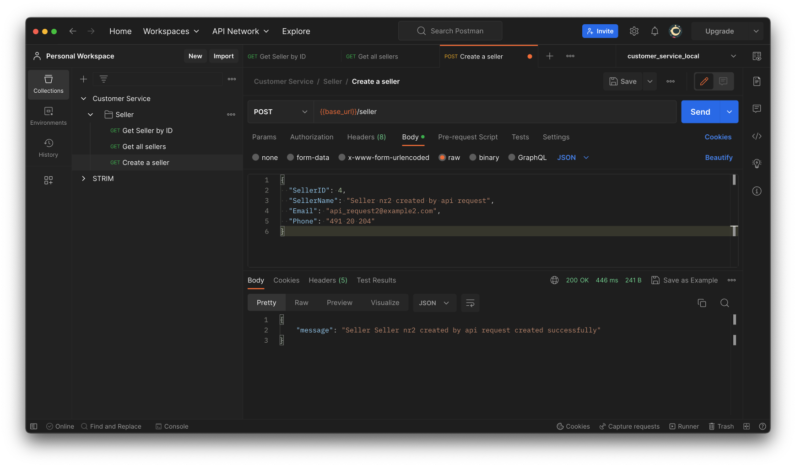
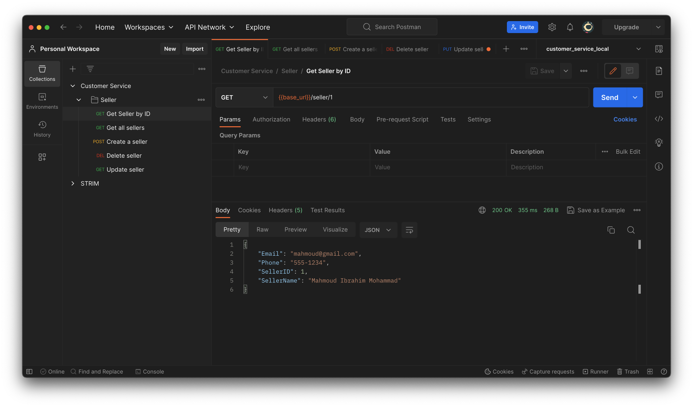
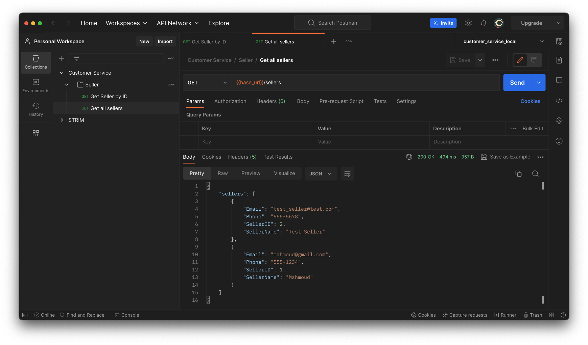
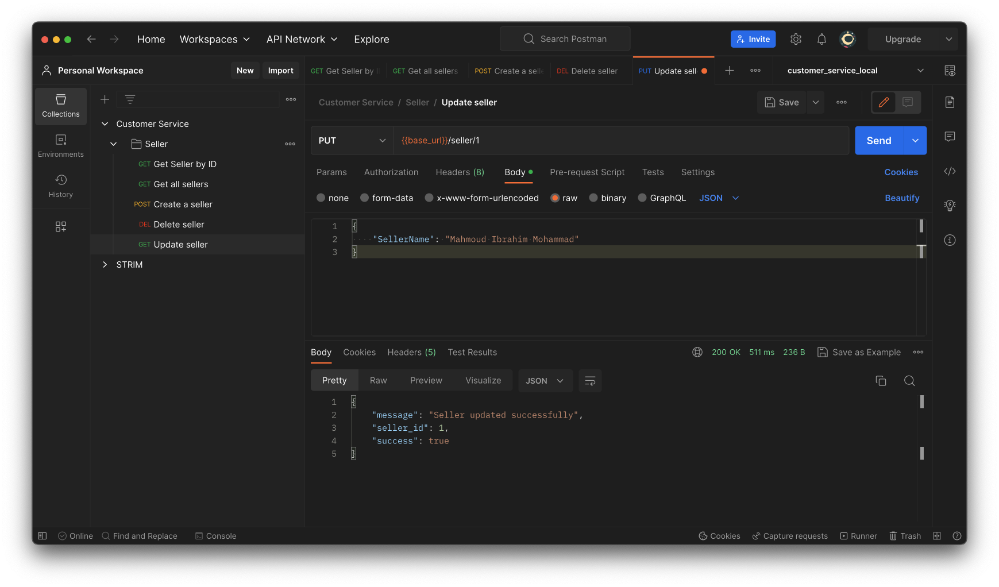
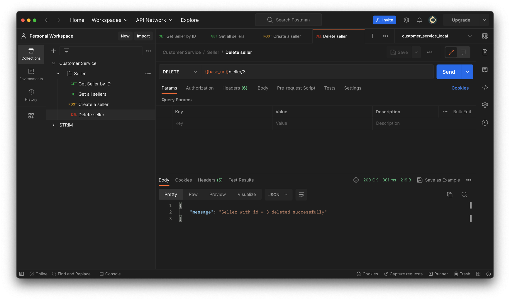

# Customer Service

This is a Customer Service API project that provides functionality for managing orders and handling issues for customer service and sellers. The project is designed to become familiar with developing web APIs and utilizing Azure services.

## Project Overview

The Customer Service API project allows users to perform various operations related to orders and customer service issues. It includes the following components:

- `api/`: Contains the API code and endpoints for handling seller, order, product and issue- related operations and customer service functionalities.

- `model/`: Contains the data model classes.

- `db/`: Contains database connecter, manager that handles functions for interacting with the database and retrieving necessary data.

- `main.py`: The main root of the application hosts all endpoints using Flask.

## Technology Stack

The Customer Service API is built using the following technologies:

- Python: The programming language used for backend development.

- Flask: A lightweight web framework used for building the API.

- Azure SQL Database: The database system used for storing and retrieving order information, customer service issues, and related data.

## Functionality Implemented

The Customer Service API provides CRUD functionality for the following entities:

- Seller

- Product

- Order

- Issues

## Database Model

The project utilizes a database to store and manage information related to sellers, products, orders, and issues. The database model consists of the following tables:

- **Sellers**: This table stores information about sellers, including their unique `SellerID`, `SellerName`, `Email`, and `Phone`.

- **Product1**: The `Product1` table represents products and includes fields such as `ProductID`, `ProductName`, `Price`, and `Description`.

- **Orders**: The `Orders` table tracks customer orders and includes fields such as `OrderID`, `CustomerName`, `OrderDate`, `TotalAmount`, and `SellerID`. The `SellerID` field is a foreign key referencing the `Sellers` table, establishing a relationship between sellers and their orders.

- **Issues**: The `Issues` table records issues related to orders. It includes fields such as `IssueID`, `IssueDescription`, `IssueDate`, and `OrderID`. The `OrderID` field is a foreign key referencing the `Orders` table, creating a link between issues and their corresponding orders.

- **OrderProducts**: The `OrderProducts` table is created based on many-to-many relationship between orders and products. It contains the `OrderID`, `ProductID`, and `Quantity` fields. The composite primary key `(OrderID, ProductID)` ensures uniqueness, and the foreign key references to the `Orders` and `Product1` tables establish the relationships between orders and products.

## Usage

To run the Customer Service API, follow these steps:

1. Clone the repository to your local machine.

2. Configure the database connection in the `db/config.py` file.

3. Run the application using `python3 main.py`.

4. Access the API endpoints using an HTTP client like Postman.

### Example Requests

To interact with the Customer Service API, I used PostMan. You can use another HTTP client or build Frontend application to send requests and handle response.
Here are some example requests using PostMan:

1. **Create a new seller:**

   

2. **Get seller by id:**

   
   
3. **Get all sellers:**

   

4. **Update an seller:**

   

5. **Delete an seller:**

   

## Future Enhancements

The following are some possible future enhancements for the Customer Service API:

- Implement authentication and authorization mechanisms to secure the API endpoints speciality for Seller endpoints.

- Add additional validation and error handling for input data.

- Create Web/mobile application to send request and handle response from this API

